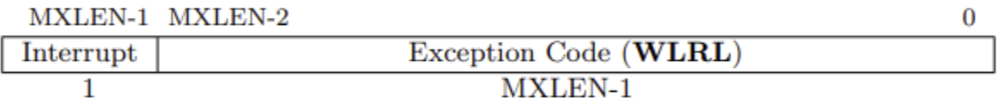
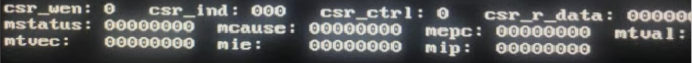
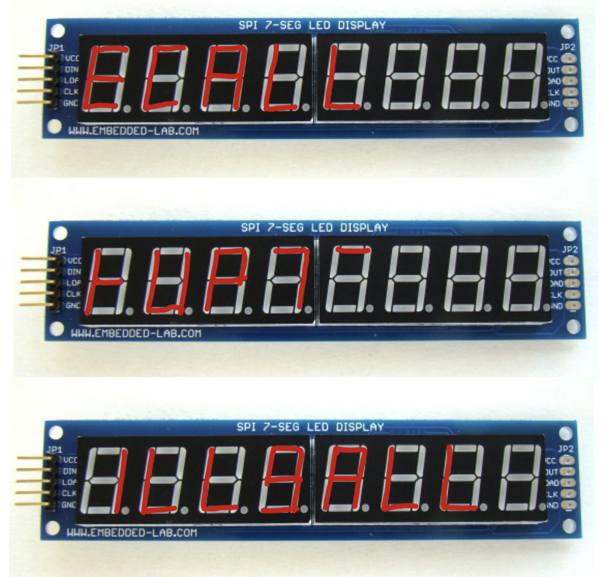
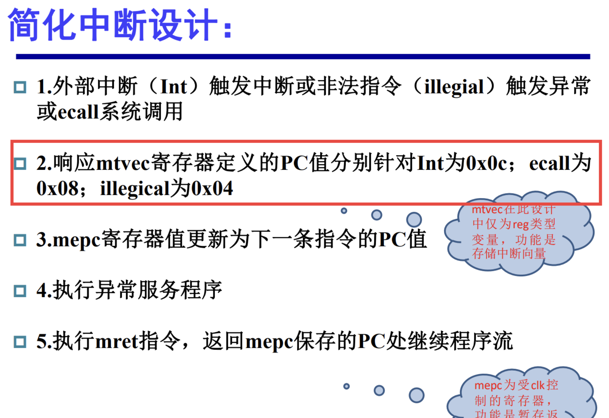

# Lab4-4

!> 本实验作为Bonus部分，请同学们根据自己的实际情况选择完成。

## 实验内容

这里给出实验的相关指导，你可以根据提示完成实验。

1. When the core enters a trap:

   1. The core will store current state, the cause and address of current instruction to corresponding register.
   2. Jump to the handler table stored in register `mtvec`. (In our lab, we use naive implementation)

2. `mcause` register:

   

   1. `mcause` stores the cause of current trap.
   2. If the trap was caused by an interruption, set the interrupt bit.
   3. The exception code can be defined as you like.

3. Registers should be updated when entering a trap:

   1. update `mcause` with `is_interuupt` and `exception_code`
   2. update `mtval` with exception-specific information
   3. update `mstatus` with current mode
   4. update `mstatus` to do something (like disable interrupt when requesting a higher privilege instruction or set exception level)
   5. update `mepc` with current instruction address

## 验收要求

1. You should design your own test code based on lab4.3 TA code.

2. You need to design 3 service codes for 3 trap situations (interrupt, ecall and illegal).

   - We have 3 modes in lab4.3 TA code except for the startup mode, you should trigger one trap in each mode.

     - You should read line 120-131 to get the tag corresponded to the mode.

   - Each service should do the following things:

     - Protect current CPU status. (RegFile, Memory status and everything that is essential for restoring running the normal instructions you think)

     - Display the related register values on the screen.

       

     - Show type characters on the 7-seg LEDs.

       

       - Seg mapping pattern in pattern mode.

         - We have 32-bit RAM data and copy it to the left 32-bit to get a 64-bit pattern, which is used for us 8-digit 7-seg LEDs, $8*(7+1)=64$.
         - So take a simple example `0xFFFFDF3D`, after the mapping, it will be `0xFF39FFFF`.
         - Then you can decode the mapped result with the 7-seg hardware relationship, and it will light up only the second digit’s a, b, f and g LEDs to get a small rectangle.
         - Another example `0xFFFFBCFB`, you can map it to `0xFFFF39FF`, it will light up only the third digit’s a, b, f and g to get a small rectangle.

         ```verilog
         module SSeg_map(input[63:0]Disp_num, 
                         output[63:0]Seg_map
         					 );
         
            assign Seg_map = {Disp_num[0], Disp_num[4],  Disp_num[16], Disp_num[25], Disp_num[17], Disp_num[5],  Disp_num[12], Disp_num[24], 							 
         							Disp_num[1], Disp_num[6],  Disp_num[18], Disp_num[27], Disp_num[19], Disp_num[7],  Disp_num[13], Disp_num[26], 
         							Disp_num[2], Disp_num[8],  Disp_num[20], Disp_num[29], Disp_num[21], Disp_num[9],  Disp_num[14], Disp_num[28], 
         							Disp_num[3], Disp_num[10], Disp_num[22], Disp_num[31], Disp_num[23], Disp_num[11], Disp_num[15], Disp_num[30],
         							                                                                                   
         							Disp_num[0], Disp_num[4],  Disp_num[16], Disp_num[25], Disp_num[17], Disp_num[5],  Disp_num[12], Disp_num[24], 
         							Disp_num[1], Disp_num[6],  Disp_num[18], Disp_num[27], Disp_num[19], Disp_num[7],  Disp_num[13], Disp_num[26], 
         							Disp_num[2], Disp_num[8],  Disp_num[20], Disp_num[29], Disp_num[21], Disp_num[9],  Disp_num[14], Disp_num[28], 
         							Disp_num[3], Disp_num[10], Disp_num[22], Disp_num[31], Disp_num[23], Disp_num[11], Disp_num[15], Disp_num[30]};
         	            
         endmodule
         ```

       - So when you have a hardware light up pattern, you should reverse that process to get its origin data in RAM.

       - With current IP, we can only set the half part of 7-seg LEDs, the other part is copied, so you may be choose some short word pattern in your service.

     - Restore from the trap and make sure the lab4.3 TA code can run continually and correctly.

   - Notice that the service is designed with assembly code and should appended in lab4.3 TA code’s tail. So the PC address in slides should also be modified and the exact value depends on you own design.

     

3. When you finish all of your design, you should modify the code in line148 and 149.

   - You shold make sure that the `jalr` in line 149 can jump to tag `loop2`.
   - You can modify 0x150 or 0x24 or both to achieve the goal instead of replacing it with other instructions.