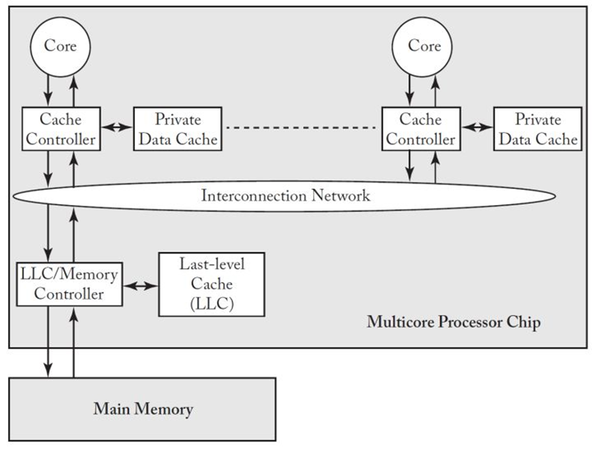
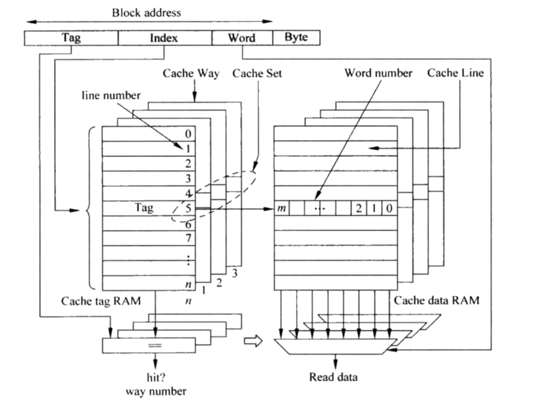
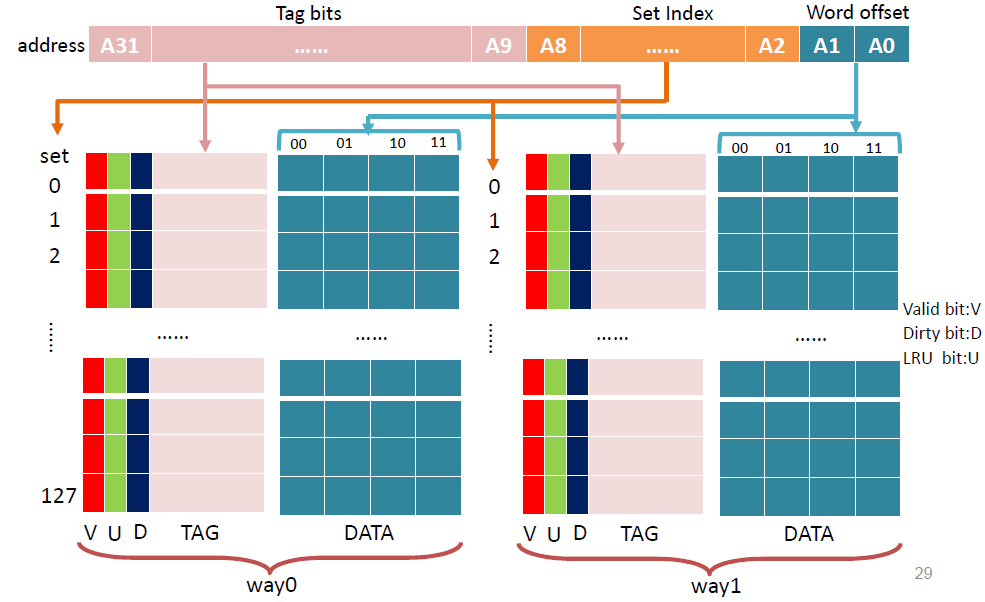
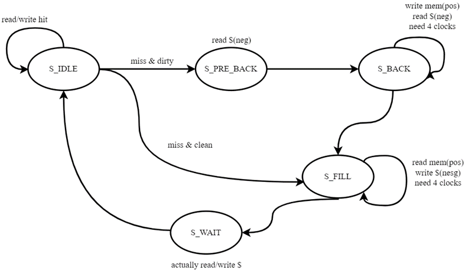
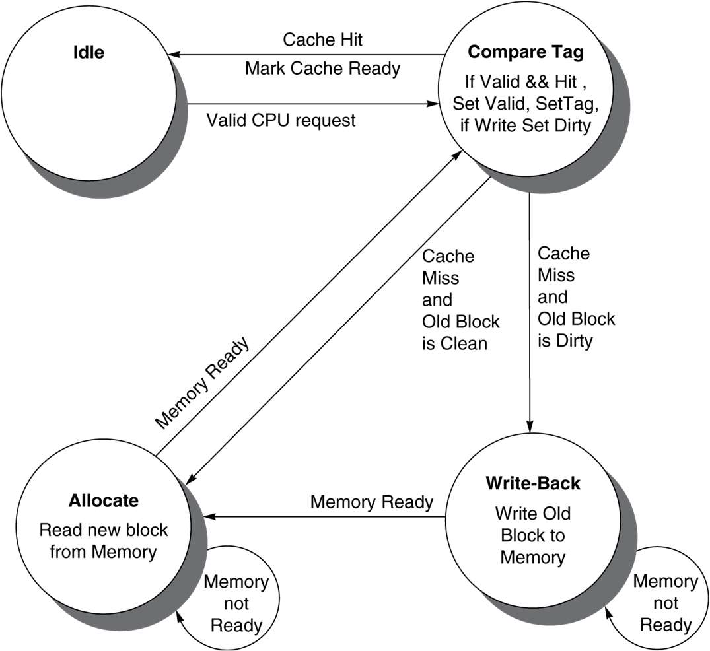

# Lab 6 Cache设计

本次实验在于帮助大家理解课堂上我们所学习的Cache的相关内容，并设计2-way组相联的Cache。

本实验目前只要求**完成到仿真即可**，不要求将Cache结合到CPU之中。当然，如果你感兴趣的话也可以试试将Cache加入到流水线内，此时你可能需要为Cache Controller模块增添一些内容来帮助你控制Cache和Memory之间的数据传输。

> 本实验在今年有较大的调整和变化，本文档内容均为全新撰写，不保证绝对的正确性，请带着批判的眼光阅读。如果你发现了文档中的错误，欢迎随时与我联系~

## 背景介绍

首先我们来看一下现在处理器中的内存层次结构是什么样的，以及cache在其中的地位与作用。

这个图描述的是现在处理器中的内存层次，当然，在我们的实验里并没有实现多核的架构。

每个cache会配一个cache controller, 这个cache controller是cache的管理单元。它会接收读写请求，然后访问cache，根据hit miss情况读写cache和内存。

如果cache hit了，controller就会把数据返回给core

如果cache miss了，controller就需要请求lower level memory

## 设计架构

接下来我们看一下cache的组织。

下面这张图简单展示了一个4路组关联的cache,他在这里分了两块存储，一块是tag存储，一块是data存储，每一片是一路。然后data存储里面每个单元存储了多个word, 可以看到这里有0, 1, 到m的编号。

当你用一个访问某个内存地址的时候，这个地址会被拆分成几个部分，

* byte offset: 指示是这个word中的第几个byte
* word offset: 指示是这个cache block的第几个word
* index: 对应了line number
* tag: 决定了hit/miss, hit的话是哪个cache way发生hit了

再来细看这个地址的访问过程：

首先根据index去索引某一行，这一行对应了4个cache way。

然后会比较tag, 决定是否hit, 哪一路hit, 然后data的话以word offset指示这个多路选择器选择哪个word。

当然，上面那幅图还是比较简略，如valid，LRU等这些位都没有提到。在你的涉及中可能需要考虑这些因素。

整个访问过程可以用有限状态机来实现，实现原理图可以参考下图：

或者这一幅有限状态机的设计图：

## 基本参数

对于cache来说，有一些比较关键的参数设置。比如block size, 一个block是64 byte还是32 byte还是多少；然后是直接映射，组相联还是全相连；替换策略上，是FIFO，LRU还是Random；写策略上时write back还是write through等等。

我们在这个实验中实现的cache是一个4KB的cache，采用2路组关联，替换策略用的是LRU。地址为32位，其中`tag`, `index`, `offset`分别为23、7、2 bit。

因此，我们可以看一下cache的实现中，cache block的结构。

在每个cache block会存这些信息：Tag，Data，以及 Valid 这是说明数据是否有效，Dirty表明数据是否修改，LRU是用来做替换策略的。在实现上，这些field都可以是开了一个reg的vector。

## 仿真验收

参考PPT上的仿真代码进行仿真即可。